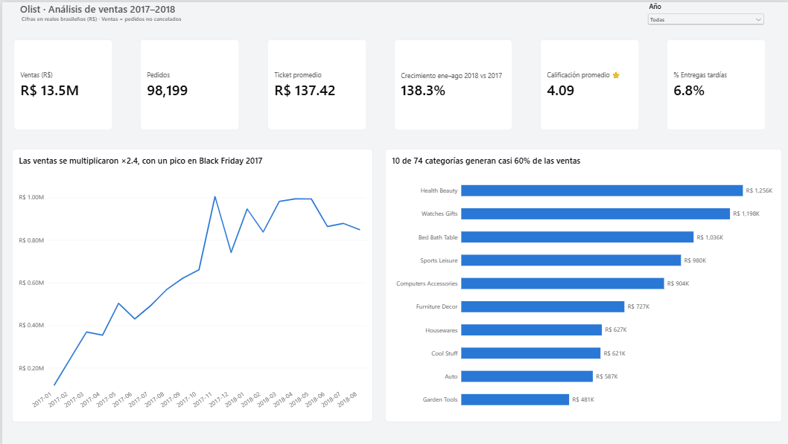
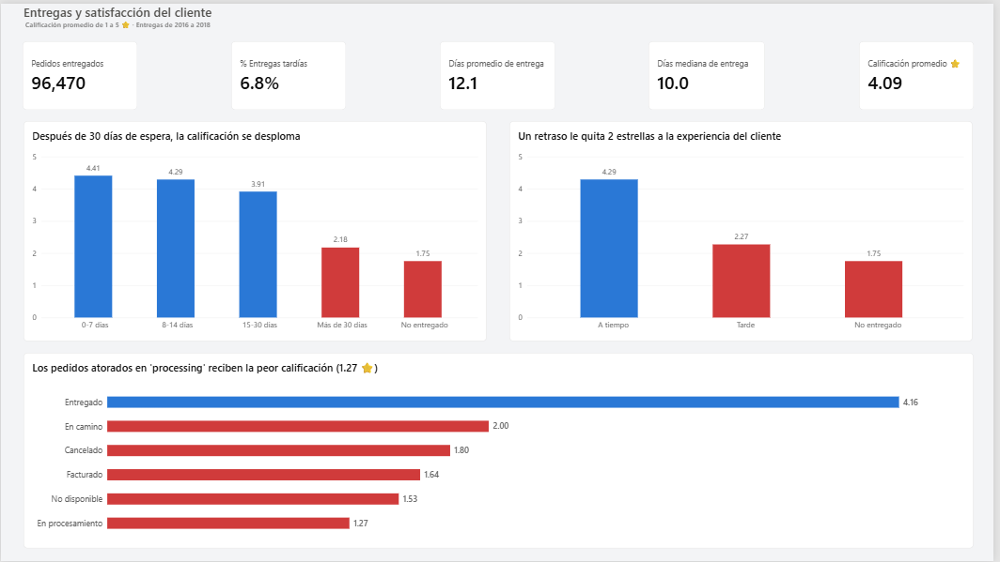
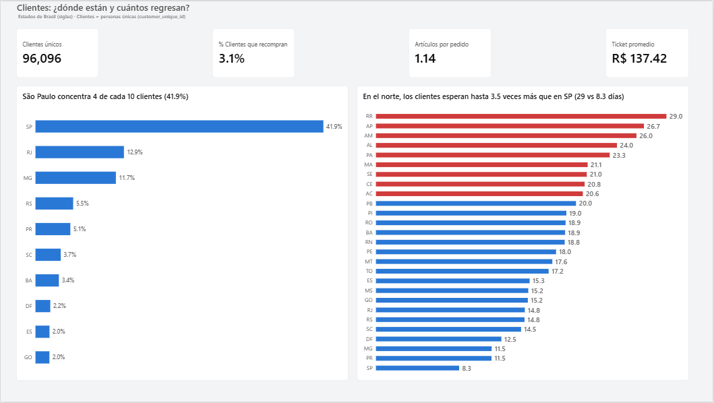

# 🛒 Análisis de e-commerce Olist · Power BI

🇺🇸 **[Read in English](README.md)**


Análisis de principio a fin de **99,441 pedidos** de Olist, un marketplace brasileño de e-commerce (2016–2018): perfilado de datos, limpieza, análisis exploratorio, modelado, medidas DAX, un dashboard bilingüe en Power BI y recomendaciones de negocio.

---

## 🎯 Mensaje principal

> **Olist está creciendo rápido (ventas ×2.4 en un año), pero ese crecimiento depende de clientes nuevos: solo 3.1% vuelve a comprar, y cuando una entrega llega tarde la calificación cae de 4.29 a 2.27 estrellas. Cumplir la fecha prometida y trabajar la recompra son las dos palancas con mayor potencial.**

📄 Reporte completo: **[Resumen ejecutivo (ES)](docs/resumen_ejecutivo_ES.md)**

---

## 📊 Dashboard

**Resumen de ventas**


**Entregas y satisfacción**


**Clientes**


> El dashboard es completamente bilingüe: el archivo `.pbix` incluye 3 páginas en español y 3 en inglés. Descárgalo desde [`/powerbi`](powerbi/).

---

## ❓ Preguntas de negocio

1. ¿Cómo evolucionan las ventas y hay estacionalidad?
2. ¿Qué categorías generan más ingresos?
3. ¿Quiénes son los clientes, dónde están y cuántos vuelven a comprar?
4. ¿Cómo afectan las entregas tardías a la satisfacción del cliente?

## 💡 Hallazgos principales

| Área | Hallazgo |
|---|---|
| 📈 Crecimiento | Las ventas se multiplicaron **×2.4** (ene–ago 2018 vs. ene–ago 2017), con un pico de **+52%** en Black Friday 2017 |
| 🏷️ Categorías | **10 de 74 categorías** generan el **58.8%** de las ventas |
| 👥 Clientes | Solo **3.1%** vuelve a comprar · **1.14** artículos por pedido · São Paulo = **41.9%** de los clientes |
| 🚚 Entregas | **6.8%** de los pedidos llega tarde · Calificación: a tiempo **4.29 ⭐** → tarde **2.27 ⭐** → no entregado **1.75 ⭐** |
| 🧭 Geografía | Los estados del norte esperan hasta **3.5 veces más** que São Paulo, pero califican casi igual → **el cliente castiga que no se cumpla la promesa, no la espera** |

## ✅ Recomendaciones

| # | Recomendación | Meta del KPI (12 meses) | Impacto estimado |
|---|---|---|---|
| 1 | Cumplir la fecha prometida (recalibrar estimados, alertar pedidos en riesgo) | % tarde: 6.8% → < 5% | ≈ 1,700 experiencias negativas menos |
| 2 | Programa de recompra | Recompra: 3.1% → 5% | ≈ R$ 250K |
| 3 | Venta cruzada ("comprados juntos") | Artículos por pedido: 1.14 → 1.25 | ≈ R$ 1.3M |
| 4 | Priorizar las 10 categorías líderes | Ventas del top 10 +15% | ≈ R$ 1.2M |
| 5 | Preparar Black Friday (campañas + logística) | Nov vs. oct: +52% → +70% | ≈ R$ 120K |

*Estimaciones aproximadas sobre la base histórica del dataset, en reales brasileños (R$).*

---

## 🔧 Proceso

| Paso | Herramienta | Qué hice |
|---|---|---|
| 1. Perfilado de datos | LibreOffice Calc | Conteo de filas, estados, valores vacíos y rango de fechas; cuadre de totales |
| 2. Limpieza y ETL | Power Query (Power BI) | Carga de 8 tablas, auditoría de llaves primarias, corrección de encabezados, traducción y corrección de categorías, deduplicación de reseñas, columnas de tiempos de entrega. **16 hallazgos de calidad documentados**, cada uno con su decisión |
| 3. Análisis exploratorio | Google Sheets | BUSCARX + tablas dinámicas: ventas mensuales, crecimiento interanual, concentración de categorías (Pareto), descomposición del ticket promedio |
| 4. Modelo de datos | Power BI | Modelo tipo estrella con 8 tablas, tabla calendario en DAX y relaciones 1:* / 1:1 |
| 5. Medidas DAX | Power BI | Más de 20 medidas (ventas, crecimiento comparable, KPIs de entrega, mediana, tasa de recompra, % del total), todas **validadas** contra Google Sheets |
| 6. Dashboard | Power BI | 3 páginas × 2 idiomas, tema propio, títulos con la conclusión, formato condicional |
| 7. Storytelling | Markdown | Resumen ejecutivo con hallazgos, recomendaciones, KPIs e impacto estimado |

📚 Detalle técnico: [Medidas DAX](docs/dax_measures.md) · [Bitácora de calidad de datos](docs/data_quality_log.md)

## 🛠️ Habilidades demostradas

`Perfilado de datos` · `Limpieza de datos` · `Power Query (M)` · `Modelado de datos` · `DAX` (CALCULATE, inteligencia de tiempo, VAR/RETURN, REMOVEFILTERS) · `Validación de datos` · `BUSCARX` · `Tablas dinámicas` · `Visualización de datos` · `Diseño de dashboards` · `Storytelling de negocio` · `Reportes bilingües (ES/EN)`

---

## 📁 Estructura del repositorio

```
├── README.md                  ← Versión en inglés
├── README.es.md               ← Estás aquí (español)
├── images/                    ← Capturas del dashboard (ES y EN)
├── powerbi/
│   ├── olist_ventas.pbix      ← Archivo de Power BI (6 páginas, ES y EN)
│   ├── olist_theme.json       ← Tema propio, apto para daltonismo
│   └── olist_dashboard.pdf    ← Exportación en PDF
└── docs/
    ├── executive_summary_EN.md
    ├── resumen_ejecutivo_ES.md
    ├── dax_measures.md
    └── data_quality_log.md
```

## ▶️ Cómo reproducirlo

1. Descarga el dataset de Kaggle: [Brazilian E-Commerce Public Dataset by Olist](https://www.kaggle.com/datasets/olistbr/brazilian-e-commerce).
2. Instala [Power BI Desktop](https://aka.ms/pbidesktopstore) (gratis, Windows).
3. Abre `powerbi/olist_ventas.pbix` y actualiza las rutas de los datos (**Transformar datos → Configuración de origen de datos**) para que apunten a tu carpeta de CSV.
4. Análisis exploratorio en Google Sheets: [ver hoja de cálculo](LINK_GOOGLE_SHEETS) *(solo lectura)*.

## ⚠️ Supuestos y limitaciones

- **Venta** = pedido no cancelado ni no disponible. Sin datos de costos (no se analiza margen) ni de devoluciones.
- Crecimiento medido solo con meses comparables (ene–ago); 2016 y sep–oct 2018 están incompletos.
- Solo hay un noviembre completo → la estacionalidad de Black Friday aún no puede confirmarse.
- Correlación ≠ causalidad. Las muestras pequeñas se señalan o se excluyen.

---

## 👩‍💻 Autora

**Dámaris Cubos Rosas** · Analista de Datos Junior
[LinkedIn](LINK_LINKEDIN) · [Portafolio](LINK_PORTFOLIO)

*Datos: Olist, publicados en Kaggle bajo licencia CC BY-NC-SA 4.0.*
