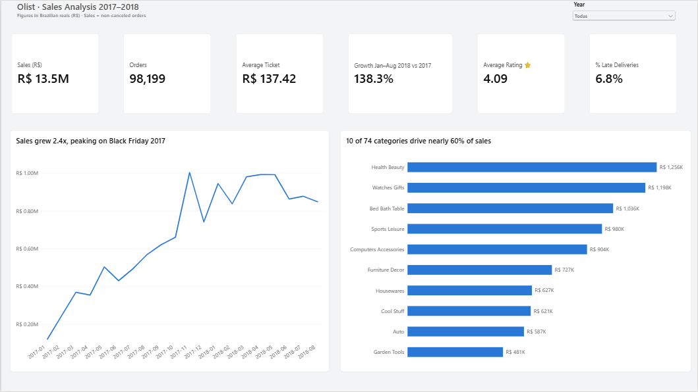
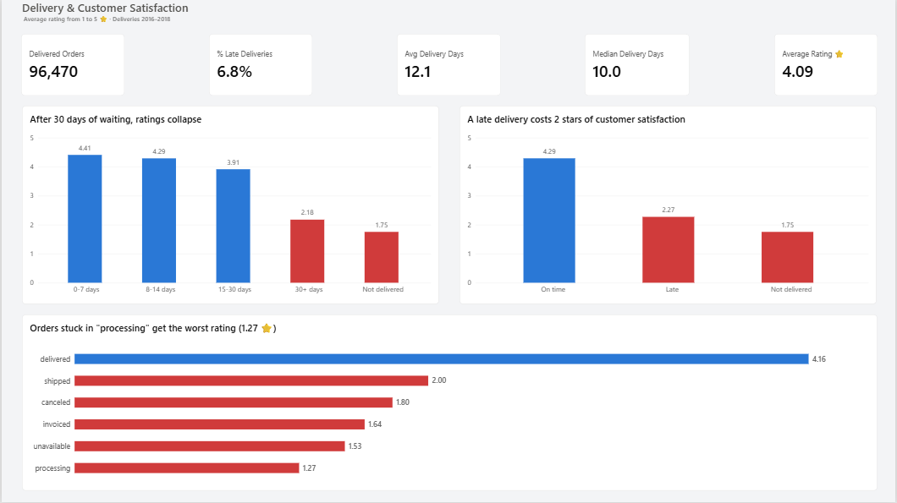
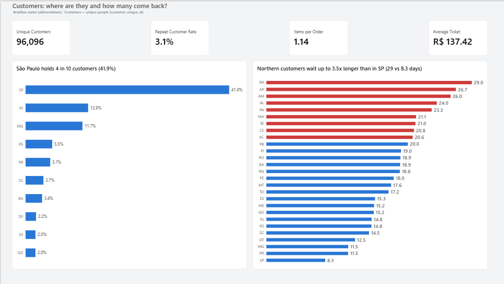

# 🛒 Olist E-commerce Analysis · Power BI

🇪🇸 **[Leer en español](README.es.md)**


End-to-end analysis of **99,441 orders** from Olist, a Brazilian e-commerce marketplace (2016–2018): data profiling, cleaning, exploratory analysis, data modeling, DAX measures, a bilingual Power BI dashboard, and business recommendations.

---

## 🎯 Key message

> **Olist is growing fast (sales up 2.4x in one year), but that growth relies on new customers: only 3.1% buy again, and when a delivery is late the rating drops from 4.29 to 2.27 stars. Keeping delivery promises and driving repeat purchases are the two levers with the greatest potential.**

📄 Full report: **[Executive Summary (EN)](docs/executive_summary_EN.md)**

---

## 📊 Dashboard

**Sales Overview**


**Delivery & Satisfaction**


**Customers**


> The dashboard is fully bilingual: the `.pbix` file includes 3 pages in Spanish and 3 in English. Download it from [`/powerbi`](powerbi/).

---

## ❓ Business questions

1. How are sales evolving, and is there seasonality?
2. Which categories generate the most revenue?
3. Who are the customers, where are they, and how many come back?
4. How do late deliveries affect customer satisfaction?

## 💡 Key findings

| Area | Finding |
|---|---|
| 📈 Growth | Sales grew **2.4x** (Jan–Aug 2018 vs. Jan–Aug 2017), with a **+52%** peak on Black Friday 2017 |
| 🏷️ Categories | **10 of 74 categories** drive **58.8%** of sales |
| 👥 Customers | Only **3.1%** of customers buy again · **1.14** items per order · São Paulo = **41.9%** of customers |
| 🚚 Delivery | **6.8%** of orders arrive late · Rating: on time **4.29 ⭐** → late **2.27 ⭐** → not delivered **1.75 ⭐** |
| 🧭 Geography | Northern states wait up to **3.5x longer** than São Paulo, yet rate almost the same → **customers punish broken promises, not long waits** |

## ✅ Recommendations

| # | Recommendation | KPI target (12 months) | Estimated impact |
|---|---|---|---|
| 1 | Keep the delivery promise (recalibrate estimates, alert at-risk orders) | % late: 6.8% → < 5% | ≈ 1,700 fewer negative experiences |
| 2 | Repeat-purchase program | Repeat rate: 3.1% → 5% | ≈ R$ 250K |
| 3 | Cross-selling ("frequently bought together") | Items per order: 1.14 → 1.25 | ≈ R$ 1.3M |
| 4 | Prioritize the top 10 categories | Top-10 sales +15% | ≈ R$ 1.2M |
| 5 | Prepare for Black Friday (campaigns + logistics) | Nov vs. Oct: +52% → +70% | ≈ R$ 120K |

*Rough estimates on the dataset's historical baseline, in Brazilian reais (R$).*

---

## 🔧 Process

| Step | Tool | What I did |
|---|---|---|
| 1. Data profiling | LibreOffice Calc | Row counts, status breakdown, missing values, date range; reconciled totals |
| 2. Cleaning & ETL | Power Query (Power BI) | Loaded 8 tables, audited primary keys, fixed headers, translated and corrected categories, deduplicated reviews, created delivery-time columns. **16 data-quality findings documented**, each with a decision |
| 3. Exploratory analysis | Google Sheets | XLOOKUP + pivot tables: monthly sales, year-over-year growth, category concentration (Pareto), average ticket breakdown |
| 4. Data model | Power BI | Star-like model with 8 tables, a DAX calendar table, and 1:* / 1:1 relationships |
| 5. DAX measures | Power BI | 20+ measures (sales, like-for-like growth, delivery KPIs, median, repeat rate, % of total) — all **cross-validated** against Google Sheets |
| 6. Dashboard | Power BI | 3 pages × 2 languages, custom theme, insight-driven titles, conditional formatting |
| 7. Storytelling | Markdown | Executive summary with findings, recommendations, KPIs and estimated impact |

📚 Technical details: [DAX measures](docs/dax_measures.md) · [Data-quality log](docs/data_quality_log.md)

## 🛠️ Skills demonstrated

`Data profiling` · `Data cleaning` · `Power Query (M)` · `Data modeling` · `DAX` (CALCULATE, time intelligence, VAR/RETURN, REMOVEFILTERS) · `Data validation` · `XLOOKUP` · `Pivot tables` · `Data visualization` · `Dashboard design` · `Business storytelling` · `Bilingual reporting (EN/ES)`

---

## 📁 Repository structure

```
├── README.md                  ← You are here (English)
├── README.es.md               ← Spanish version
├── images/                    ← Dashboard screenshots (EN & ES)
├── powerbi/
│   ├── olist_ventas.pbix      ← Power BI file (6 pages, EN & ES)
│   ├── olist_theme.json       ← Custom colorblind-safe theme
│   └── olist_dashboard.pdf    ← PDF export
└── docs/
    ├── executive_summary_EN.md
    ├── resumen_ejecutivo_ES.md
    ├── dax_measures.md
    └── data_quality_log.md
```

## ▶️ How to reproduce

1. Download the dataset from Kaggle: [Brazilian E-Commerce Public Dataset by Olist](https://www.kaggle.com/datasets/olistbr/brazilian-e-commerce).
2. Install [Power BI Desktop](https://aka.ms/pbidesktopstore) (free, Windows).
3. Open `powerbi/olist_ventas.pbix` and update the data source paths (**Transform data → Data source settings**) to point to your CSV folder.
4. Exploratory analysis in Google Sheets: [view spreadsheet](LINK_GOOGLE_SHEETS) *(read-only)*.

## ⚠️ Assumptions & limitations

- **Sale** = order not canceled or unavailable. No cost data (no margin analysis) and no return data.
- Growth measured only on comparable months (Jan–Aug); 2016 and Sep–Oct 2018 are incomplete.
- Only one complete November → Black Friday seasonality cannot be confirmed yet.
- Correlation ≠ causation. Small samples are flagged or excluded.

---

## 👩‍💻 Author

**Dámaris Cubos Rosas** · Junior Data Analyst
[LinkedIn](LINK_LINKEDIN) · [Portfolio](LINK_PORTFOLIO)

*Data: Olist, published on Kaggle under the CC BY-NC-SA 4.0 license.*
